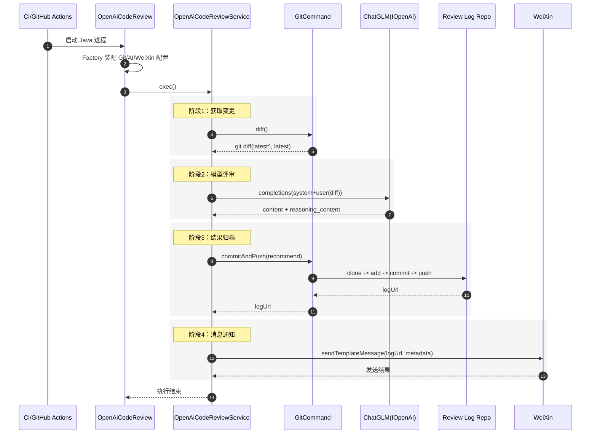

# openai-code-review-sdk 核心逻辑设计文档

## 1. 设计目标与边界

### 1.1 目标定义

`openai-code-review-sdk` 的核心目标是构建一个可在 CI 环境直接运行的 **自动化代码评审流水线引擎**，实现：

- 从 Git 提交中提取增量代码（`diff`）；
- 通过大模型完成结构化评审；
- 将评审结果固化到日志仓库形成可追溯资产；
- 将结果以微信模板消息实时通知研发人员。

### 1.2 系统边界

该 SDK 处于 **任务编排层** 与 **基础设施适配层** 之间，向上承载业务编排，向下屏蔽外部系统细节（GitHub、ChatGLM、微信 API）。

---

## 2. 架构分层与职责映射

### 2.1 分层模型

- **入口层（Application）**：`OpenAiCodeReview` 完成依赖组装与任务启动。
- **领域服务层（Domain Service）**：`AbstractOpenAiCodeReviewService` 定义评审模板流程，`OpenAiCodeReviewService` 落地具体实现。
- **基础设施层（Infrastructure）**：
  - `GitCommand`：Git 差异读取、日志仓库提交与推送；
  - `ChatGLM`：大模型请求、重试与响应解析；
  - `WeiXin`：模板消息发送。
- **配置与环境层（Config + Utils）**：`*ConfigFactory`、`EnvUtils` 负责环境变量聚合、默认值和容错策略。

### 2.2 设计模式亮点

- **模板方法模式（Template Method）**：`AbstractOpenAiCodeReviewService#exec` 固定四阶段主流程，子类仅实现差异化步骤。
- **工厂模式（Factory）**：`GitConfigFactory`、`AIConfigFactory`、`WeiXinConfigFactory` 将配置构造与业务执行解耦。
- **策略思想（Interface-based Strategy）**：`IOpenAI` 抽象大模型能力，允许替换为任意兼容实现（如 OpenAI、Claude）。
- **门面化入口（Facade-like Bootstrap）**：`OpenAiCodeReview` 作为统一启动门面，降低接入复杂度。

---

## 3. 核心业务时序

### 3.1 业务时序图（Mermaid）



### 3.2 关键步骤说明

- **步骤 S1（差异抽取）**：通过 `git log -1` 获取最新提交哈希，再执行 `git diff latest^ latest`，确保评审范围精确锚定一次提交。
- **步骤 S2（评审生成）**：系统提示词约束模型角色为高级架构师；用户消息注入完整 diff，上下文最小化但任务聚焦。
- **步骤 S3（审计落盘）**：评审结果以 Markdown 文件写入独立日志仓库，文件名中编码项目、分支、作者、日期、随机尾缀，降低命名冲突概率。
- **步骤 S4（结果广播）**：以模板消息发送 `logUrl + commit 元数据`，将离线归档结果转化为可消费通知。

---

## 4. 关键类协作与核心伪代码

### 4.1 主流程伪代码（Template Method）

```java
exec():
  diff = getDiffCode()
  review = codeReview(diff)
  logUrl = recordCodeReview(review)
  pushMessage(logUrl)
```

该流程体现 **控制反转**：流程骨架稳定，外部能力实现可替换。

### 4.2 ChatGLM 调用伪代码（容错重试）

```java
for attempt in [1..maxRetries]:
  try:
    response = httpPost(apiHost, apiKey, requestBody, timeout)
    if response.code not in 2xx: throw BizException
    return parse(response.body)
  catch SocketTimeoutException:
    backoff(attempt * retryBackoff)
throw TimeoutException
```

关键价值是将 **超时重试策略** 内聚于基础设施层，避免领域流程污染重试细节。

---

## 5. 设计亮点（面试展示重点）

### 5.1 高内聚低耦合的可演化结构

- 领域层只表达“评审任务四阶段”，不暴露 HTTP、JGit、微信 API 细节。
- 外部系统变化（模型供应商替换、通知渠道替换）可局部替换，不破坏主流程。

### 5.2 配置治理与运行时稳态

- `EnvUtils` 提供 **系统环境变量 > 当前目录 .env > 父目录 .env** 的分级解析，兼容本地与 CI。
- AI 超时参数、重试次数、退避时间可配置，支持在高延迟场景下快速调优。

### 5.3 可观测与可审计闭环

- 评审结果入日志仓库形成可追溯审计链；
- 通知消息包含项目、分支、提交者、提交信息，便于追责与复盘。

---

## 6. 可靠性分析与改进方向

### 6.1 当前风险点

- **同步链路长尾风险**：LLM 调用慢会阻塞 CI 总时长。
- **日志仓库并发冲突**：多流水线同时 push 可能触发远端冲突。
- **异常降级不足**：`exec()` 统一捕获后仅日志记录，缺少告警分级与重试编排。

### 6.2 演进建议（可作为面试加分项）

- 引入 **异步队列化**：CI 只负责入队，评审异步消费，降低主流水线阻塞。
- 增加 **幂等键**（commit hash + repo + branch）防重复评审。
- 将日志落盘从 Git 仓库演进到对象存储或检索系统，提升高并发写入与检索能力。
- 加入 **失败补偿机制**：按阶段做重试与死信处理（LLM 失败、push 失败、通知失败）。

---

## 7. 面试叙事模板

我将代码评审任务抽象为一个四阶段模板流程：**差异抽取、模型评审、结果归档、消息通知**。在实现上使用 **模板方法模式** 固化流程骨架，使用 **工厂模式** 管理配置装配，使用接口抽象隔离模型厂商差异。这样做的结果是：主流程稳定、基础设施可替换、配置可调优，同时通过日志仓库与微信通知形成了可审计闭环，具备可演进到异步高并发架构的基础。

