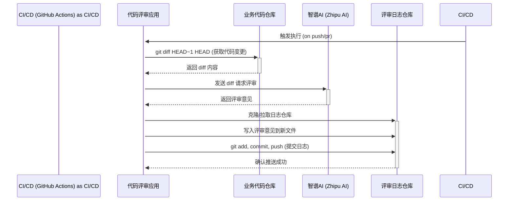

# 项目逻辑总结与面试视角分析

这个项目本质上是一个 **自动化代码评审机器人**，它被设计为在持续集成（CI）环境中运行，比如在 GitHub Actions 中。当有新的代码提交时，它会自动执行，完成以下任务。

### 项目核心逻辑

1.  **获取代码变更**：脚本首先会执行 `git diff HEAD~1 HEAD` 命令，提取最近一次提交的代码变更内容。
2.  **调用大模型 API**：它会将提取到的代码变更（diff）作为上下文，连同一个精心设计的 Prompt（提示词），发送给智谱 AI（Zhipu AI）的大模型 API。这个 Prompt 会指示 AI 扮演一个“高级编程架构师”的角色，对代码进行评审。
3.  **记录评审日志**：脚本接收到 AI 返回的评审意见后，并不会直接评论在代码仓库的 Pull Request 中，而是将这份评审报告作为一个 Markdown 文件，提交（Commit）并推送（Push）到另一个独立的 Git 仓库（`openai-code-review-log`）中进行归档。

简单来说，整个流程就是：**触发 -> 拉取代码变更 -> 请求 AI 评审 -> 归档评审日志**。

### 项目逻辑流程图 (Mermaid)

下面是这个流程的 Mermaid 流程图，你可以直接复制到支持 Mermaid 的编辑器（如 Typora、Notion 或直接在 GitLab/GitHub 的 Markdown 中）进行预览。

### 面试官视角

当你在面试中介绍这个项目时，可以预见面试官会从以下几个角度来考察你的技术深度和广度。

**1. 字节高并发场景下的潜在风险**

*   **AI 服务单点 & 性能瓶颈**：
    *   **风险**: 当前实现是同步调用智谱 AI 的 API。在高并发场景下（例如，团队成员在短时间内大量提交代码），AI 服务接口的响应延迟会成为整个 CI/CD 流程的瓶颈，导致开发者合并代码的等待时间过长。如果 AI 服务宕机，整个代码评审流程将完全中断。
    *   **日语术语**: 同期呼び出し (dōki yobidashi - 同步调用), 単一点障害 (tan'itsu ten shōgai - 单点故障)。
*   **日志仓库写冲突**：
    *   **风险**: 多个 CI/CD 任务实例可能同时克隆 `openai-code-review-log` 仓库，并在同一时间尝试推送。虽然 JGit 内部有一定的处理机制，但在极端高并发下，依然存在推送失败（Push Failed）的风险，导致部分评审日志丢失。
    *   **日语术语**: 書き込み競合 (kakikomi kyōgō - 写冲突)。
*   **安全性问题**：
    *   **风险**: `GITHUB_TOKEN` 和 `ZHIPU_AI_API_KEY` 目前通过环境变量注入，这本身是标准做法。但风险在于 CI/CD 的日志输出。如果在脚本的任何地方意外打印了这些 Token，它们就会暴露在 CI/CD 的控制台日志中，造成严重的安全泄漏。

**2. 对应的 JVM 优化或数据库优化建议**

虽然这个项目没有直接使用数据库，但我们可以从系统设计的角度提出优化建议。

*   **引入消息队列 (Message Queue) 解耦**：
    *   **建议**: 将同步调用 AI API 的模式重构为异步模式。CI/CD 任务仅需将 `git diff` 的结果和元数据（如 commit id, author）发送到消息队列（如 RabbitMQ, Kafka）中。然后由一个独立的 Worker 服务消费队列中的消息，异步调用 AI 服务并将结果写入日志仓库。
    *   **优点**:
        1.  **削峰填谷**：应对瞬间的并发提交，保护下游 AI 服务不被冲垮。
        2.  **异步解耦**：CI/CD 流程可以快速完成，开发者无需等待 AI 评审结果。
        3.  **失败重试**：如果 AI 服务调用失败或日志仓库推送失败，可以方便地实现重试机制。
    *   **日语术语**: メッセージキュー (messēji kyū - 消息队列), 非同期処理 (hidōki shori - 异步处理)。
*   **优化日志存储方式**：
    *   **建议**: 使用 Git 仓库存储日志虽然巧妙，但并非为高频写入设计。可以考虑将日志存储在更专业的系统中，如 **Elasticsearch** 或专门的 **日志服务**（如阿里云 SLS、腾讯云 CLS）。
    *   **优点**: 提供强大的检索、分析和可视化能力，方便后续对评审质量和效率进行度量。避免了 Git 操作的开销和并发问题。

**3. ROI (投入产出比) 评估**

*   **方案复杂度**：
    *   当前方案非常简单，依赖项少，易于部署和理解，属于“小而美”的工具。对于中小型团队或个人项目，这是一个非常高效的实践，**没有过度工程化**。
    *   引入消息队列和日志服务会显著增加系统复杂度和维护成本，需要专门的团队来保障中间件的稳定性。
*   **学习产出 (简历亮点)**：
    *   **项目经验部分**: 可以描述为“**设计并实现了一个基于大模型的自动化 Code Review 机器人**，集成于 CI/CD 流程，旨在提升代码质量和团队开发效率。”
    *   **技术亮点 (可深入阐述)**:
        1.  **CI/CD 自动化**：熟悉 GitHub Actions/GitLab CI 的 Pipeline 设计与脚本编排。
        2.  **大模型应用工程化**：具备将大模型（LLM）能力集成到现有开发工作流的实践经验，特别是 Prompt Engineering（提示词工程）和 API 集成。
        3.  **系统解耦与优化思考**：可以主动提出上述关于“异步化”、“消息队列”的优化方案，展示你对系统高可用、高并发场景的设计能力，这会是**非常大的加分项**。
